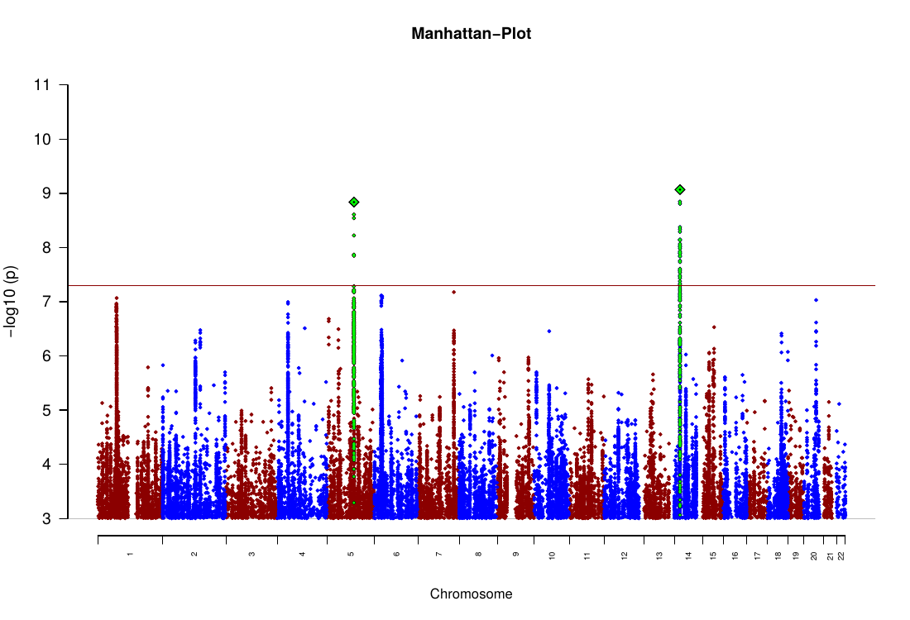
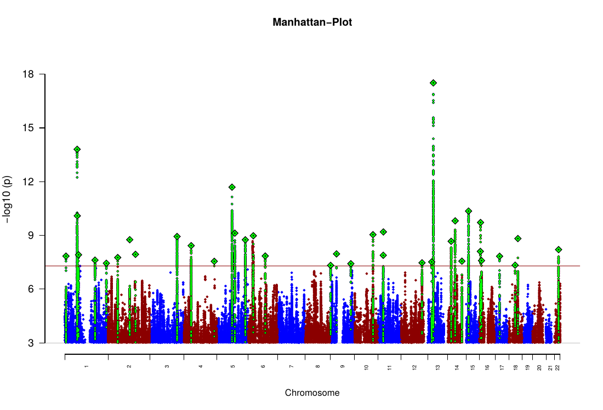

# [Project overview](index.html)

Recent PGC MDD GWAS ([Wray...Sullivan 2018](https://www.nature.com/articles/s41588-018-0090-3?_ga=2.222013656.112907065.1541203200-2059058911.1541203200), [Howard...McIntosh 2019](https://www.nature.com/articles/s41593-018-0326-7)) contain summary statistics from [UK Biobank](https://www.ukbiobank.ac.uk/) (UKBB). Here we create summary statistics that have UK Biobank participants removed.

There are 959 participants that overlap between PGC MDD and UKBB cohorts. In previous analyses, this overlap was handled by removing overlapping individuals from the UKBB analysis. Thus, becuase these individuals were retained in the PGC cohorts, even versions of the Wray or Howard summary statistics that excluded the UKBB summary statistics from the meta-analysis (leave-one-out [LOO] with reference `noUKBB`) would overlap with the whole UKBB sample. For this analysis, we removed overlapping individuals from the PGC MDD cohorts before conducting the meta-analysis, and refer to these results as `rmUKBB` (**remove** UK Biobank).

Analysis performed on the [LISA cluster](http://geneticcluster.org/) using [Ricopili](https://sites.google.com/a/broadinstitute.org/ricopili/). The R code embedded in this document can be run while this document is rendered but bash code is set to not evaluated but can be submitted to the cluster to reproduce this analysis.

# Setup

## Directory setup

`DIR` is a stand-in for the location of each data set

```{bash, eval=FALSE}

mkdir data

# overlap data
ln -s /home/DIR/959_PGC_UKB_overlap.txt data/

# MDD Wave1 data
ln -s /home/DIR/v1/* data/

# BOMA data
ln -s /home/DIR/v1_boma/* data/

# GenRED
ln -s /home/DIR/v1_genred/* data/

```

## RICOPILI

[Install RICOPILI](https://docs.google.com/document/d/14aa-oeT5hF541I8hHsDAL_42oyvlHRC5FWR7gir4xco/edit#heading=h.y8igfs7neh22)

```{bash, eval=FALSE}

#Install and unpack ricopili in your home directory
wget https://sites.google.com/a/broadinstitute.org/ricopili/download//rp_bin.2019_Jun_25.001.tar.gz

tar -xvzf rp_bin.2019_Jun_25.001.tar.gz

```

See the [ricopili.conf](https://personal.broadinstitute.org/sripke/share_links/rp_config_collections/rp_config.custom.sripke.lisa.slurm.0819a) file for LISA.


# PGC MDD2-UKBB overlap

Overlap between PGC MDD and UKBB cohorts were matched by [genotype checksums](https://personal.broadinstitute.org/sripke/share_links/checksums_download/) (see also [Turchin and Hirschhorn 2012](https://academic.oup.com/bioinformatics/article/28/6/886/312495)).

```{r}

library(readr)
library(dplyr)
library(stringr)
library(tidyr)
library(readxl)
library(ggplot2)

overlap <- read_table2('data/959_PGC_UKB_overlap.txt', col_names=c('CS', 'FID', 'IID'))

``` 

Tally PGC cohorts with overlap

```{r}

cohorts_count <- 
overlap %>%
filter(CS != 'CheckSum.GenerationScotland.cs') %>%
select(FID) %>%
separate(FID, into=c('FID', 'IID'), sep='\\*') %>%
separate(FID, into=c('status', 'disorder', 'cohort', 'ancestry', 'sr', 'platform'), sep='_') %>% 
group_by(cohort) %>%
tally()

cohorts_count

```

The additional overlap not listed is from with the [Generation Scotland cohort](https://ccbs-stradl.github.io/GenScot-MDD-rmUKBB/).

# Phenotypes

For cohorts with overlap, create MDD case/control phenotype files where phenotype of overlapping participants is set to missing (`-9`).

```{r}

fams <- lapply(cohorts_count$cohort, function(cohort) {

        fam_file <- list.files('data', paste0('mdd_', cohort, '.+\\.fam$'), full.names=TRUE)

        if(length(fam_file > 0)) {
            fam <- read_table2(fam_file, col_names=c('FID', 'IID', 'father', 'mother', 'sex', 'pheno'), col_types='ccccii')
        } else {
           warning(paste('No .fam file for cohort', cohort))
           fam <- NULL
        }

        return(fam)
})

fams_pheno <- 
bind_rows(fams) %>%
select(FID, IID, pheno)

fams_pheno %>%
group_by(pheno) %>%
tally()

```

Only retain phenotypes of participants from cohorts with overlap and set the phenotype of participants in the overlap file to `-9`

```{r}

rmUKBB_pheno <- 
fams_pheno %>%
left_join(overlap, by=c('FID', 'IID')) %>%
mutate(pheno=if_else(is.na(CS), true=pheno, false=-9L))

rmUKBB_pheno %>%
group_by(pheno) %>%
tally()

write_tsv(rmUKBB_pheno, 'data/mdd_rmUKBB.pheno', col_names=F)

```

Write out `datasets_info` to list the cohorts to analyze

```{r}

datasets_info <- str_replace(unlist(sapply(cohorts_count$cohort, function(cohort) list.files('data', paste0('mdd_', cohort, '.+\\.ch\\.fl$')), simplify=TRUE, USE.NAMES=FALSE)), pattern='dasuqc1_', replacement='')

write(datasets_info, 'data/datasets_info', ncol=1) 

```

# GWAS

Run the Ricopoli pipeline

```{bash, eval=FALSE}

cd data
postimp_navi --out pgc_MDD13 --addout rmUKBB \
--mds MDD29.0515.nproj.menv.mds_cov \
--coco 1,2,3,4,5,6 --pheno mdd_rmUKBB.pheno \
--popname eur \
--onlymeta --noclump --noldsc --nolahunt

cd ../

```

## Output checks

Check the sumstats file against the imputation panel

```{r gwas_check, cache=TRUE}

mdd13_rmUKBB_daner <- read_tsv('data/report_pgc_MDD13_rmUKBB/daner_pgc_MDD13_rmUKBB.gz')

daner_snps <-
mdd13_rmUKBB_daner %>% 
  filter(FRQ_U_14006 >= 0.01 & FRQ_U_14006 <= 0.99) %>% 
  mutate(MB=floor(BP/1e6)) %>%
  group_by(CHR, MB) %>%
  summarise(snpObs=n())

sumfrq_eur <- read_table2('/home/gwas/pgc-samples/hapmap_ref/impute2_ref/1KG_Aug12/ALL_1000G_phase1integrated_v3_impute_macGT1/sumfrq.eur', col_names=c('SNP', 'COUNT', 'A1', 'FRQ_A1', 'A2', 'FRQ_A2', 'A1_COUNT', 'CHR', 'BP'))

impute_snps <-
sumfrq_eur %>%
  filter(FRQ_A1 >= 0.01) %>%
  mutate(MB=floor(BP/1e6)) %>%
  group_by(CHR, MB) %>%
  summarise(snpRef=n())

output_snps <- daner_snps %>%
  left_join(impute_snps, by=c('CHR', 'MB')) %>%
  mutate(snpObs=if_else(is.na(snpObs), true=0L, false=snpObs))

ggplot(output_snps, aes(x=snpObs, y=snpRef)) +
geom_point() +
scale_x_continuous('SNP count observed') +
scale_y_continuous('SNP count expected') +
coord_fixed()

```

## Meta-analysis setup

Copy anchor cohort single datasets that removed UKBB and link additional datasets for meta-analysis

```{bash, eval=FALSE}

mkdir -p data/summary_stats_0120_rmUKBB/single_dataset/additional_datasets

# single datasets run here
cp data/report_pgc_MDD13_rmUKBB/daner_mdd_*.gz data/summary_stats_0120_rmUKBB/single_dataset/

# rename to indicate that UKB overlap was removed
## NB: LISA has a PERL version of rename
rename 's/_eur/_rmUKBB_eur/' data/summary_stats_0120_rmUKBB/single_dataset/*.gz 

# single datasets run elsewhere
cp $DIR/summary_stats_0517/jjp2_exc.UKBsamples/daner_mdd_jjp2_4UKB_exc.sa.2102.gz data/summary_stats_0120_rmUKBB/single_dataset/daner_mdd_jjp2_rmUKBB_eur_sr-qc.hg19.ch.fl.gz

# additional datasets

# copy GenScot removing UKBB
cp DIR/daner_mdd_genscot_1119a_rmUKBB.aligned.gz data/summary_stats_0120_rmUKBB/single_dataset/additional_datasets/

# symlink other additional datasets except for GenScot, UKBB, and iPsych
ln -s $DIR/summary_stats_0517/single_dataset/additional_datasets/daner_{GERA,mdd_decode}*.gz data/summary_stats_0120_rmUKBB/single_dataset/additional_datasets/

# symlink iPsych
ln -s $DIR/summary_stats_0517_ipsych/daner_mddGWAS_new_ipsych_170220.meta.gz data/summary_stats_0120_rmUKBB/single_dataset/additional_datasets/

```

Link anchor cohort single datasets that did not need to remove UKBB.

```{bash, eval=FALSE}

for daner in $DIR/summary_stats_0517/single_dataset/daner_mdd_*.gz; do
        # get filename
        daner_file=$(basename $daner)
        # get cohort name
        cohort=$(echo $daner_file | awk -F_ '{print $3}')
        # check if there is not already a daner file with this name
        if [ ! -f data/summary_stats_0120_rmUKBB/single_dataset/*${cohort}*.gz ]; then
                echo "Adding cohort ${cohort}"
                ln -s $daner data/summary_stats_0120_rmUKBB/single_dataset/
       else
               echo "Already have cohort ${cohort}"
       fi
done

```

# Meta-analysis

Meta-analyze PGC MDD anchor cohorts

```{bash, eval=FALSE}

mkdir -p data/meta
cd data/meta

# symlink all sumstats into the meta analysis working directory
ln -s ../summary_stats_0120_rmUKBB/single_dataset/daner*.gz . 

# list of anchor cohort sumstats file
ls daner_mdd_*.gz > anchor_dataset_dir

# check that none of the symlinks are broken
for daner in daner_mdd_*.gz; do
        if [ ! -e $daner ]; then
          echo "$daner does not exist"
        fi
done

# symlink the reference file
ln -s ../reference_info .

postimp_navi --result anchor_dataset_dir --onlymeta --out MDD29.0120a.rmUKBB 

cd ../../

```

Copy meta analysis file

```{bash, eval=FALSE}

cp data/meta/report_MDD29.0120a.rmUKBB/daner_MDD29.0120a.rmUKBB.gz data/summary_stats_0120_rmUKBB/single_dataset/

``` 

## Full meta analysis excluding 23andMe

Set up full meta analysis

```{bash, eval=FALSE}

mkdir -p data/full_meta
cd data/full_meta

ln -s ../summary_stats_0120_rmUKBB/single_dataset/daner_MDD29.0120a.rmUKBB.gz .

ln -s ../summary_stats_0120_rmUKBB/single_dataset/additional_datasets/daner_*.gz .

ls daner_*.gz > full_dataset_dir

ln -s ../reference_info .

postimp_navi --result full_dataset_dir --nolahunt --out pgc_mdd_meta_w2_no23andMe_rmUKBB

cd ../../


```

Copy out sumstats and supporting files

```{bash, eval=FALSE}

mkdir -p data/summary_stats_0120_rmUKBB/pgc_mdd_full_meta_no23andMe

REPORT=data/full_meta/report_pgc_mdd_meta_w2_no23andMe_rmUKBB
INFIX=pgc_mdd_meta_w2_no23andMe_rmUKBB

cp -L $REPORT/areas.fo.het.${INFIX}.pdf.gz \
$REPORT/areas.fo.${INFIX}.pdf \
$REPORT/areas.${INFIX}.pdf \
$REPORT/basic.${INFIX}.num.xls \
$REPORT/daner_${INFIX}.gz.p3.gz \
$REPORT/daner_${INFIX}.gz.p4.clump.areator.sorted.1mhc \
$REPORT/daner_${INFIX}.gz.p4.clump.areator.sorted.1mhc.xls \
$REPORT/daner_${INFIX}.het.gz.p4.clump.areator.sorted.1mhc \
$REPORT/daner_${INFIX}.het.gz.p4.clump.areator.sorted.1mhc.xls \
$REPORT/manhattan.daner_${INFIX}*.pdf \
$REPORT/${INFIX}*qq.pdf \
data/summary_stats_0120_rmUKBB/pgc_mdd_meta_no23andMe

# retain sumstats rows with the correct number of columns (19)
# this arises from SNPs that are only present in one of the underlying cohorts and
# some of the supplementary columns are not included. This removes an acceptably 
# small number of SNPS (< 100)
zcat $REPORT/daner_${INFIX}.gz | awk -F $'\t' '{if(NF == 19) {print $0}}' | gzip -c > data/full_meta/daner_${INFIX}.gz


```

Check number of excluded SNPs
```{bash daner_miss_cols, cache=TRUE}

REPORT=data/full_meta/report_pgc_mdd_meta_w2_no23andMe_rmUKBB
INFIX=pgc_mdd_meta_w2_no23andMe_rmUKBB
zcat $REPORT/daner_${INFIX}.gz | awk -F $'\t' '{if(NF < 19) {print $0}}' | wc -l 

```

Check for duplicated CPIDs

```{r full_meta_no23am, cache=TRUE}

full_meta_no23am_daner <- read_tsv('data/full_meta/daner_pgc_mdd_meta_w2_no23andMe_rmUKBB.gz')

# CPID
cpid_dups <-
full_meta_no23am_daner %>%
  group_by(CHR, BP) %>%
  tally() %>%
  filter(n > 1)

nrow(cpid_dups)

# SNP
snp_dups <-
full_meta_no23am_daner %>%
  group_by(SNP) %>%
  tally() %>%
  filter(n > 1) %>%
  arrange(n)

nrow(snp_dups)

# drop duplicated CPIDs
full_meta_no23am_daner_nodups <- full_meta_no23am_daner %>%
  anti_join(cpid_dups, by=c('CHR', 'BP')) %>%
  arrange(CHR, BP)

write_tsv(full_meta_no23am_daner_nodups, 'data/summary_stats_0120_rmUKBB/pgc_mdd_full_meta_no23andMe/daner_pgc_mdd_meta_w2_no23andMe_rmUKBB.gz')


```


### Results

```{r}

read_excel('data/summary_stats_0120_rmUKBB/pgc_mdd_full_meta_no23andMe/daner_pgc_mdd_meta_w2_no23andMe_rmUKBB.gz.p4.clump.areator.sorted.1mhc.xls') %>%
	select(-`LD-friends(0.1).p0.001`, -`LD-friends(0.6).p0.001`, -`gwas_catalog_span.6`) %>%
	filter(P <= 5e-8)

```

```{bash full_meta_no23am_man, cache=TRUE}

mkdir -p results

pdftoppm -png -r 100 data/summary_stats_0120_rmUKBB/pgc_mdd_full_meta_no23andMe/manhattan.daner_pgc_mdd_meta_w2_no23andMe_rmUKBB.gz.nog2.pdf results/manhattan.daner_pgc_mdd_meta_w2_no23andMe_rmUKBB.gz.nog2

```



## Full meta analysis


```{bash, eval=FALSE}

mkdir -p data/full_meta_23am
cd data/full_meta_23am

ln -s $DIR/23andme_whole_genome/daner_23andMe_v5_170227_pgc_aligned_.assoc.gz .
ln -s ../summary_stats_0120_rmUKBB/single_dataset/daner_MDD29.0120a.rmUKBB.gz .
ln -s ../summary_stats_0120_rmUKBB/single_dataset/additional_datasets/daner_*.gz .

ls daner_*.gz > full_dataset_dir

ln -s ../reference_info .

postimp_navi --result full_dataset_dir --nolahunt --out pgc_mdd_meta_w2_rmUKBB

```

Copy results files
```{bash, eval=FALSE}

mkdir -p data/summary_stats_0120_rmUKBB/pgc_mdd_full_meta

REPORT=data/full_meta_23am/report_pgc_mdd_meta_w2_rmUKBB
INFIX=pgc_mdd_meta_w2_rmUKBB

cp -L $REPORT/areas.fo.het.${INFIX}.pdf.gz \
$REPORT/areas.fo.${INFIX}.pdf \
$REPORT/areas.${INFIX}.pdf \
$REPORT/basic.${INFIX}.num.xls \
$REPORT/daner_${INFIX}.gz.p3.gz \
$REPORT/daner_${INFIX}.gz.p4.clump.areator.sorted.1mhc \
$REPORT/daner_${INFIX}.gz.p4.clump.areator.sorted.1mhc.xls \
$REPORT/daner_${INFIX}.het.gz.p4.clump.areator.sorted.1mhc \
$REPORT/daner_${INFIX}.het.gz.p4.clump.areator.sorted.1mhc.xls \
$REPORT/manhattan.daner_${INFIX}*.pdf \
$REPORT/${INFIX}*qq.pdf \
data/summary_stats_0120_rmUKBB/pgc_mdd_full_meta

# retain sumstats rows with the correct number of columns (19)
zcat $REPORT/daner_${INFIX}.gz | awk -F $'\t' '{if(NF == 19) {print $0}}' | gzip -c > data/full_meta_23am/daner_${INFIX}.gz

```

Check for duplicated CPIDs

```{r full_meta, cache=TRUE}

full_meta_daner <- read_tsv('data/full_meta_23am/daner_pgc_mdd_meta_w2_rmUKBB.gz')

# CPID
cpid_dups <-
full_meta_daner %>%
  group_by(CHR, BP) %>%
  tally() %>%
  filter(n > 1)

nrow(cpid_dups)

# SNP
snp_dups <-
full_meta_daner %>%
  group_by(SNP) %>%
  tally() %>%
  filter(n > 1) %>%
  arrange(n)

nrow(snp_dups)

# drop duplicated CPIDs
full_meta_daner_nodups <- full_meta_daner %>%
  anti_join(cpid_dups, by=c('CHR', 'BP')) %>%
  arrange(CHR, BP)

write_tsv(full_meta_daner_nodups, 'data/summary_stats_0120_rmUKBB/pgc_mdd_full_meta/daner_pgc_mdd_meta_w2_rmUKBB.gz')


```

### Results

```{r}

read_excel('data/summary_stats_0120_rmUKBB/pgc_mdd_full_meta/daner_pgc_mdd_meta_w2_rmUKBB.gz.p4.clump.areator.sorted.1mhc.xls') %>%
	select(-`LD-friends(0.1).p0.001`, -`LD-friends(0.6).p0.001`, -`gwas_catalog_span.6`) %>%
	filter(P <= 5e-8)

```

```{bash full_meta_man, cache=TRUE}

mkdir -p results

pdftoppm -png -r 100 data/summary_stats_0120_rmUKBB/pgc_mdd_full_meta/manhattan.daner_pgc_mdd_meta_w2_rmUKBB.gz.nog2.pdf results/manhattan.daner_pgc_mdd_meta_w2_rmUKBB.gz.nog2

```


